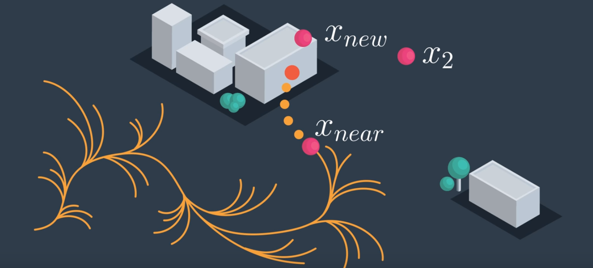

# AAE_Notebook_020_PotentialField
This notebook explores the potential field theory of multirotor control...

In the last few notebooks, we've just worried about looking for control sequences that satisfy the differential constraints of the Dubin's Car model; but, we also need to look for control sequences that don't collide with any obstacles.

We can incorporate obstacles in two places. Given the graph or tree of possible curves that our vehicle might be following, we can check for kinematic feasibility when we sample X-new. Then, more importantly, when we're attempting to steer to this point using the steer function, we can modify the simulate function to check at each step along the way -- walking along the curve.

Do we disregard the edge simply because it's to have a collision? No. We can simply stop and put X-New prior to the obstacle and start propagating horizontally. With that, we've extended our RT implementation.

We may also use potential fields to aid our navigation.

